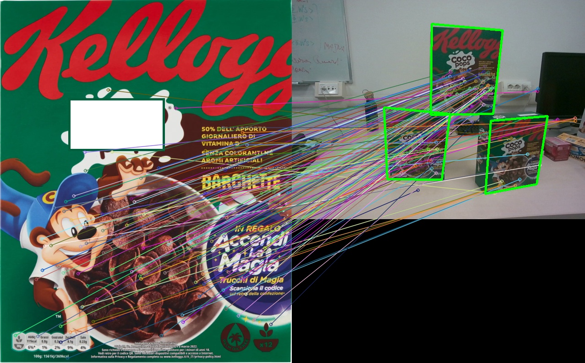

# Template matching in depth images

Template matching is a very practical technique for finding all the occurrences of a known target in a given query image. Deep-learning techniques are not very flexible, requiring re-training for new templates. Traditional computer vision techniques (e.g. SIFT + RANSAC) are more practical but require an underlying model (homography) describing the transformation between the template and its occurrences in the query image. When there are several occurrences of the same template in the scene, template matching becomes a robust multi-model fitting problem, which requires to disambiguate among multiple spurious matches.

## Goal
The goal of this project is to expand a template detection pipeline based on images only, to RGB-D data. Point clouds should be leveraged to constraints the homography search in regions belonging to the same planar surface in the scene. Another research direction would be to adaptively identify which template to search first in the target image, which is a very relevant problem when the number of templates is very large (e.g. a few hundreds) by exploiting the 3D data of the scene.

## Approach
The most known algorithms that solve the template matching problem, reach the goal by performing the following operations:
- feature extraction from the template and the scene.
- feature matching and selection.
- fit the homographies via sequential Ransac.
As can be easily noticed the most vulnerable parts of the above pipeline are clearly the elaboration of the huge number of features extracted from the scene
at the beginning of the process and the identification of key points to use for the computation of the homography.

The approach followed during the project development was to start from the above pipeline and try to improve its performance by acting on the most vulnerable parts, in particular the techniques implemented use filters to reduce the number of key points to examine and fit the homography in different ways than the usual. 

### Canny Filter Method
To decrease the number of key points extracted by SIFT from the image, a Canny edge detection is been implemented. It is assumed that object edges can be exploited to choose the most useful key points to improve the performance of key point detection and matching [3]. On both RGB scene image and depth image is applied a denoised function and then the Canny method. On the resulting images Probabilistic Hough Line Transform is applied which is a more efficient implementation of the Hough Line Transform because it gives as output the extremes of the detected lines. The extracted lines from both images are compared We found the lines on both RGB and depth image so as to have more accuracy and precision on line selection since some are wrong due to image noise. Thanks to these lines we are able to construct probable rectangles which represent the boxes present on the scene. Having the rectangles and the key points of the scene, we can delete all the key points that are outside the rectangles. In this way, the number of key points usually decreases by one-third of the initial total number.

### Homography based on Dimensions

This technique is based on randomly extracting one key point and then finding other three key points around it, so to be able to find an homography with four key points.
The last three key points are to be found near the first one, where near is specified by the template’s dimensions: each template is defined by a width, height and depth, expressed in centimeters (see below). The coordinates of the last three key points should be no further away from those of the first one than the dimensions found in the dimensions.json file, depending on the template.
Clearly, the approach has to be carried out after key points identification: a task that can be completed either with or without the use of Canny Filter Method. The use of the filter can influence execution time and consistency, as illustrated in Results. 
The main flaw of this approach is its dependence on randomization, which is key in improving performance, but it can also lead to output slightly different solutions each time the algorithm is ran.

### Homography based on Rectangles
The proposed approach is based on the identification of Rectangles inside the scene and then uses them to select the regions of the image in which the al- gorithm can match the template. The use of rectangles to identify the area to analyze is due to the geometry of the boxes (template) to identify.
The identification of the areas in which the algorithm is more probable to match the pattern can be seen also seen as a filtering approach in which only the key points inside rectangles are used in the rest of the process. In the proposed implementation the rectangles are used both for filtering the key points and to fit the homography.
A noteworthy part of this approach is the identification process of rectangles, which is performed by executing the following operations: 
- Identifies lines (Canny + Hough) both from the scene and the Depth Map1
- Select the most promising lines
- Uses pairs of almost perpendicular lines (angle of 70/90 degrees) to identify the rectangles.

The bottleneck of the whole process is the identification of the rectangles and further improvement of this approach can focus on it.
